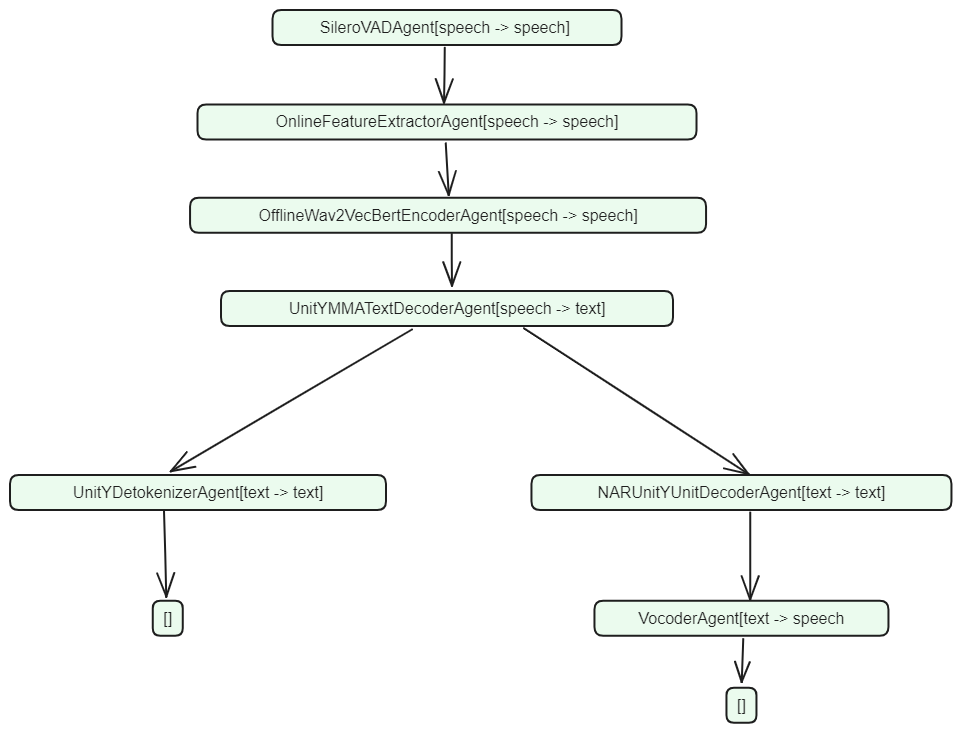

> *冯开革整理*
> *该文件记录main_demo的数据流*

- 模型Agent概述
	- system
		- `system = build_streaming_system(...)`
		``` python
		SeamlessStreamingS2STJointVADAgent(
		        SileroVADAgent[speech -> speech]
		        OnlineFeatureExtractorAgent[speech -> speech]
		        OfflineWav2VecBertEncoderAgent[speech -> speech]
		        UnitYMMATextDecoderAgent[speech -> text]
		        UnitYDetokenizerAgent[text -> text]
		        NARUnitYUnitDecoderAgent[text -> text]
		        VocoderAgent[text -> speech]
		)
		```
	- Agent关系示意图: 

- `run_streaming_inference`一次运行的输出日志
	``` shell
	sample_rate 16000
	len samples 121343
	Using cache found in /home/fengkaige/.cache/torch/hub/snakers4_silero-vad_master
	while_count: 0
	num_samples of this segment 5120
	while_count: 1
	num_samples of this segment 5120
	while_count: 2
	num_samples of this segment 5120
	while_count: 3
	num_samples of this segment 5120
	while_count: 4
	num_samples of this segment 5120
	while_count: 5
	num_samples of this segment 5120
	while_count: 6
	num_samples of this segment 5120
	while_count: 7
	num_samples of this segment 5120
	while_count: 8
	num_samples of this segment 5120
	while_count: 9
	num_samples of this segment 5120
	TextSegment
	3200.0 El examen y el testimonio de los expertos
	SpeechSegment
	while_count: 10
	num_samples of this segment 5120
	while_count: 11
	num_samples of this segment 5120
	while_count: 12
	num_samples of this segment 5120
	TextSegment
	4160.0 permitieron
	EmptySegment
	while_count: 13
	num_samples of this segment 5120
	while_count: 14
	num_samples of this segment 5120
	TextSegment
	4800.0 a la Comisión
	SpeechSegment
	while_count: 15
	num_samples of this segment 5120
	TextSegment
	5120.0 concluir
	EmptySegment
	while_count: 16
	num_samples of this segment 5120
	while_count: 17
	num_samples of this segment 5120
	while_count: 18
	num_samples of this segment 5120
	while_count: 19
	num_samples of this segment 5120
	while_count: 20
	num_samples of this segment 5120
	while_count: 21
	num_samples of this segment 5120
	TextSegment
	7040.0 que
	EmptySegment
	while_count: 22
	num_samples of this segment 5120
	TextSegment
	7360.0 cinco disparos pudieron
	SpeechSegment
	while_count: 23
	num_samples of this segment 5120
	TextSegment
	7583.9375 haber sido disparados,
	SpeechSegment
	End of VAD segment
	```
- system.pushpop - class : TreeAgentPipeline
	- type(system) : SeamlessStreamingS2STJointVADAgent
	- pushpop接口路径: `venv_seamless/lib/python3.11/site-packages/simuleval/agents/pipeline.py`
	- 内容:
		- push
		- pop
- system.push
	- 动作
		构建states
		调用`push_impl`
	- 数据
		- `self.module_dict`
- system.push_impl - class : TreeAgentPipeline
	- 关键调用: `module.pushpop`

# module.pushpop
## 模型结构分析概述
```
1. SileroVADAgent: 初步分析，无数据操作，纯为后续提供决策
2. OnlineFeatureExtractorAgent:
	核心动作是WaveformToFbankConverter，无模型结构，基于torch c++实现，源码在第三方fairseq2库中
3. OfflineWav2VecBertEncoderAgent, 核心操作:
	1. speech_encoder_frontend:
		Wav2Vec2Frontend; torch模型格式, 无法导出为torch.jit.script格式
	2. speech_encoder:
		UnitYEncoderAdaptor; torch模型格式, 无法导出为torch.jit.script格式
1. UnitYMMATextDecoderAgent:  3段模型 + 部分torch计算
	1. text_decoder_frontend：Embedding
	2. text_decoder：24层 DecoderLayer
	3. project: 1层 TiedProjection - linear
2. UnitYDetokenizerAgent: 纯python字符串操作
3. NARUnitYUnitDecoderAgent: 3段
	1. NARUnitYUnitDecoderAgent: (6层encoder, 6层decoder, 1个final_proj)
	2. 少许torch操作: max, index, argmax, sum, unsqueeze
	3. token_decoder: torch tokenizer操作没有模型结构
4. VocoderAgent: 2段
	1. 一点python操作
	2. code_generator:
		包含操作: conv1d, convtranspose1d, 15层ResBlock, ReLU, LayerNorm, Linear
```

## class SileroVADAgent

- 类信息
	- 路径: `/home/fengkaige/codespace/seamless/seamless_communication/src/seamless_communication/streaming/agents/silero_vad.py`
- 继承关系
	- class SileroVADAgent(SpeechToSpeechAgent)
		- class SpeechToSpeechAgent(GenericAgent)
			- class GenericAgent
- SileroVADAgent.pushpop 调用流程
	- -> GenericAgent.pushpop
		- -> self.push
			- self.states.update_config
			- self.states.update_source
		- -> self.pop
			- -> self.policy -> SileroVADAgent.policy()
				- SileroVADAgent.policy
					```
					SileroVADAgent.policy(...)
					"""
					The policy to make decision every time
					when the system has new input.
					The function has to return an Action instance

					Args:
						states (Optional[AgentStates]): an optional states for stateless agent

					Returns:
						Action: The actions to make at certain point.

					.. note:

						WriteAction means that the system has a prediction.
						ReadAction means that the system needs more source.
						When states are provided, the agent will become stateless and ignore self.states.
					"""
					```

## class OnlineFeatureExtractorAgent
- policy函数
	- 核心动作: `output = self.convert_to_fbank(data)["fbank"]`
		- self.convert_to_fbank -> WaveformToFbankConverter
### class WaveformToFbankConverter
- 初始化
```
        self.convert_to_fbank = WaveformToFbankConverter(
            num_mel_bins=80,
            waveform_scale=2**15 if args.denormalize else 1.0,
            standardize=False,
            device=args.device,
            dtype=args.dtype,
        )
```
- 实现
```
    class WaveformToFbankConverter:
        def __init__(
            self,
            num_mel_bins: int = 80,
            waveform_scale: float = 1.0,
            channel_last: bool = False,
            standardize: bool = False,
            keep_waveform: bool = False,
            dtype: Optional[DataType] = None,
            device: Optional[Device] = None,
            pin_memory: bool = False,
        ) -> None:
            ...

        def __call__(self, waveform: WaveformToFbankInput) -> WaveformToFbankOutput:
            ...
```
- `WaveformToFbankOutput`类的实现在`cc`中
	- 位置: `fairseq2/native/python/src/fairseq2n/bindings/data/audio.cc`
	- `__call__`函数对应操作:`waveform_to_fbank_converter::operator()`
	- `operator`实现位置: `native/src/fairseq2n/data/audio/waveform_to_fbank_converter.cc`
		- 里面调用torch c++接口做了些操作，未细看

---
## class OfflineWav2VecBertEncoderAgent
- class OfflineWav2VecBertEncoderAgent ^88f3ea
	- policy函数, 核心动作: `encoder_output, _ = self.model.encode_speech(seqs, padding_mask,)`
		- self.model - Class UnitYModel
		- -> self.model.speech_encoder_frontend - Class Wav2Vec2Frontend
			- Class Wav2Vec2Frontend - 继承 ClassTransformerFrontend
		- -> self.model.speech_encoder: UnitYEncoderAdaptor - 24层ConformerBlock
### UnitYModel
- encode_speech 函数运行的模型结构
	- speech_encoder_frontend: Wav2Vec2Frontend
	- speech_encoder: UnitYEncoderAdaptor - 24层ConformerBlock
- encode_speech相关模型的详细信息统计
		speech_encoder_frontend和speech_encoder无法导出为torch.jit.script格式

- 模型结构
- Wav2Vec2Frontend
	- Wav2Vec2FbankFeatureExtractor: torch小操作
	- LayerNorm
	- Linear
- UnitYEncoderAdaptor
	- StandardTransformerEncoder:
```
UnitYModel(
  model_dim=1024
  (speech_encoder_frontend): Wav2Vec2Frontend(
    model_dim=1024, feature_dim=160
    (feature_extractor): Wav2Vec2FbankFeatureExtractor(num_fbank_channels=80, stride=2, sample_every_k=1)
    (post_extract_layer_norm): StandardLayerNorm(normalized_shape=(160,), eps=1e-05, elementwise_affine=True)
    (model_dim_proj): Linear(input_dim=160, output_dim=1024, bias=True)
    (first_pass_dropout): None
    (pos_encoder): None
    (layer_norm): None
    (dropout): None
  )
  (speech_encoder): UnitYEncoderAdaptor(
    model_dim=1024
    (inner): StandardTransformerEncoder(
      model_dim=1024, norm_order=TransformerNormOrder.POST
      (layers): ModuleList(
        (0-23): 24 x ConformerBlock(
          model_dim=1024
          (ffn1_layer_norm): StandardLayerNorm(normalized_shape=(1024,), eps=1e-05, elementwise_affine=True)
          (ffn1): StandardFeedForwardNetwork(
            model_dim=1024
            (inner_proj): Linear(input_dim=1024, output_dim=4096, bias=True)
            (inner_activation): SiLU()
            (inner_dropout): None
            (inner_layer_norm): None
            (output_proj): Linear(input_dim=4096, output_dim=1024, bias=True)
          )
          (ffn1_dropout): None
          (self_attn_layer_norm): StandardLayerNorm(normalized_shape=(1024,), eps=1e-05, elementwise_affine=True)
          (self_attn): StandardMultiheadAttention(
            num_heads=16, model_dim=1024
            (q_proj): Linear(input_dim=1024, output_dim=1024, bias=True, init_fn=init_qkv_projection)
            (k_proj): Linear(input_dim=1024, output_dim=1024, bias=True, init_fn=init_qkv_projection)
            (v_proj): Linear(input_dim=1024, output_dim=1024, bias=True, init_fn=init_qkv_projection)
            (pos_encoder): None
            (sdpa): ShawRelativePositionSDPA(
              model_dim=1024, num_heads=16, max_left_rel_pos=64, max_right_rel_pos=8
              (rel_k_embed): StandardEmbedding(num_embeddings=73, embedding_dim=64, init_fn=init_shaw_embedding)
              (rel_v_embed): None
              (inner_sdpa): TorchSDPA(attn_dropout_p=0.0)
            )
            (output_proj): Linear(input_dim=1024, output_dim=1024, bias=True, init_fn=init_output_projection)
          )
          (self_attn_dropout): None
          (conv_layer_norm): StandardLayerNorm(normalized_shape=(1024,), eps=1e-05, elementwise_affine=True)
          (conv): ConformerConvolution(
            model_dim=1024
            (pointwise_conv1): Conv1d(1024, 2048, kernel_size=(1,), stride=(1,), bias=False)
            (pointwise_conv1_activation): GLU(dim=1)
            (depthwise_conv): Conv1d(1024, 1024, kernel_size=(31,), stride=(1,), groups=1024, bias=False)
            (batch_norm): None
            (layer_norm): StandardLayerNorm(normalized_shape=(1024,), eps=1e-05, elementwise_affine=True)
            (depthwise_activation): SiLU()
            (pointwise_conv2): Conv1d(1024, 1024, kernel_size=(1,), stride=(1,), bias=False)
          )
          (conv_dropout): None
          (ffn2_layer_norm): StandardLayerNorm(normalized_shape=(1024,), eps=1e-05, elementwise_affine=True)
          (ffn2): StandardFeedForwardNetwork(
            model_dim=1024
            (inner_proj): Linear(input_dim=1024, output_dim=4096, bias=True)
            (inner_activation): SiLU()
            (inner_dropout): None
            (inner_layer_norm): None
            (output_proj): Linear(input_dim=4096, output_dim=1024, bias=True)
          )
          (ffn2_dropout): None
          (layer_norm): StandardLayerNorm(normalized_shape=(1024,), eps=1e-05, elementwise_affine=True)
        )
      )
      (layer_norm): None
    )
    (inner_layer_norm): StandardLayerNorm(normalized_shape=(1024,), eps=1e-05, elementwise_affine=True)
    (proj1): Linear(input_dim=1024, output_dim=4096, bias=True)
    (activation): ReLU()
    (proj2): Linear(input_dim=4096, output_dim=1024, bias=True)
    (adaptor_layers): ModuleList(
      (0): UnitYTransformerAdaptorLayer(
        model_dim=1024, kernel_size=8, stride=8
        (residual_layer_norm): StandardLayerNorm(normalized_shape=(1024,), eps=1e-05, elementwise_affine=True)
        (residual_conv): Conv1d(1024, 2048, kernel_size=(8,), stride=(8,), padding=(4,))
        (residual_activation): GLU(dim=1)
        (self_attn_layer_norm): StandardLayerNorm(normalized_shape=(1024,), eps=1e-05, elementwise_affine=True)
        (self_attn_conv): Conv1d(1024, 2048, kernel_size=(8,), stride=(8,), padding=(4,))
        (self_attn_activation): GLU(dim=1)
        (self_attn): StandardMultiheadAttention(
          num_heads=16, model_dim=1024
          (q_proj): Linear(input_dim=1024, output_dim=1024, bias=True, init_fn=init_qkv_projection)
          (k_proj): Linear(input_dim=1024, output_dim=1024, bias=True, init_fn=init_qkv_projection)
          (v_proj): Linear(input_dim=1024, output_dim=1024, bias=True, init_fn=init_qkv_projection)
          (pos_encoder): None
          (sdpa): TorchSDPA(attn_dropout_p=0.1)
          (output_proj): Linear(input_dim=1024, output_dim=1024, bias=True, init_fn=init_output_projection)
        )
        (self_attn_dropout): Dropout(p=0.1, inplace=False)
        (ffn_layer_norm): StandardLayerNorm(normalized_shape=(1024,), eps=1e-05, elementwise_affine=True)
        (ffn): StandardFeedForwardNetwork(
          model_dim=1024
          (inner_proj): Linear(input_dim=1024, output_dim=4096, bias=True)
          (inner_activation): ReLU()
          (inner_dropout): None
          (inner_layer_norm): None
          (output_proj): Linear(input_dim=4096, output_dim=1024, bias=True)
        )
        (ffn_dropout): Dropout(p=0.1, inplace=False)
      )
    )
    (layer_norm): StandardLayerNorm(normalized_shape=(1024,), eps=1e-05, elementwise_affine=True)
  )####
  (text_encoder_frontend): None
  (text_encoder): None
  (text_decoder_frontend): None
  (text_decoder): None
  (final_proj): None
  (t2u_model): UnitYNART2UModel(
    (encoder): StandardTransformerEncoder(
      model_dim=1024, norm_order=TransformerNormOrder.PRE
      (layers): ModuleList(
        (0-5): 6 x StandardTransformerEncoderLayer(
          model_dim=1024, norm_order=TransformerNormOrder.PRE
          (self_attn_layer_norm): StandardLayerNorm(normalized_shape=(1024,), eps=1e-05, elementwise_affine=True)
          (self_attn): StandardMultiheadAttention(
            num_heads=16, model_dim=1024
            (q_proj): Linear(input_dim=1024, output_dim=1024, bias=True, init_fn=init_qkv_projection)
            (k_proj): Linear(input_dim=1024, output_dim=1024, bias=True, init_fn=init_qkv_projection)
            (v_proj): Linear(input_dim=1024, output_dim=1024, bias=True, init_fn=init_qkv_projection)
            (pos_encoder): None
            (sdpa): TorchSDPA(attn_dropout_p=0.0)
            (output_proj): Linear(input_dim=1024, output_dim=1024, bias=True, init_fn=init_output_projection)
          )
          (self_attn_norm): None
          (self_attn_dropout): None
          (ffn_layer_norm): StandardLayerNorm(normalized_shape=(1024,), eps=1e-05, elementwise_affine=True)
          (ffn): StandardFeedForwardNetwork(
            model_dim=1024
            (inner_proj): Linear(input_dim=1024, output_dim=8192, bias=True)
            (inner_activation): ReLU()
            (inner_dropout): None
            (inner_layer_norm): None
            (output_proj): Linear(input_dim=8192, output_dim=1024, bias=True)
          )
          (ffn_dropout): None
        )
      )
      (layer_norm): StandardLayerNorm(normalized_shape=(1024,), eps=1e-05, elementwise_affine=True)
    )
    (decoder_frontend): NARDecoderFrontend(
      (embed): StandardEmbedding(num_embeddings=10082, embedding_dim=1024, pad_idx=1, init_fn=init_scaled_embedding)
      (embed_char): StandardEmbedding(num_embeddings=10943, embedding_dim=1024, pad_idx=1, init_fn=init_scaled_embedding)
      (unit_pos_encoder): SinusoidalPositionEncoder(encoding_dim=1024, max_seq_len=4096)
      (char_pos_encoder): SinusoidalPositionEncoder(encoding_dim=1024, max_seq_len=4096)
      (char_length_regulator): HardUpsampling()
      (variance_adaptor): VarianceAdaptor(
        (duration_predictor): VariancePredictor(
          (conv1): Sequential(
            (0): Conv1d(1024, 256, kernel_size=(3,), stride=(1,), padding=same)
            (1): ReLU()
          )
          (ln1): StandardLayerNorm(normalized_shape=(256,), eps=1e-05, elementwise_affine=True)
          (dropout_module): Dropout(p=0.5, inplace=False)
          (conv2): Sequential(
            (0): Conv1d(256, 256, kernel_size=(3,), stride=(1,), padding=same)
            (1): ReLU()
          )
          (ln2): StandardLayerNorm(normalized_shape=(256,), eps=1e-05, elementwise_affine=True)
          (proj): Linear(input_dim=256, output_dim=1, bias=True)
          (film): None
        )
        (pitch_predictor): None
        (embed_pitch): None
        (vuv_predictor): None
        (energy_predictor): None
        (embed_energy): None
        (length_regulator): HardUpsampling()
      )
      (layer_norm): None
      (dropout): None
    )
    (decoder): FeedForwardTransformer(
      , norm_order=TransformerNormOrder.PRE
      (layers): ModuleList(
        (0-5): 6 x FeedForwardTransformerLayer(
          (self_attn): StandardMultiheadAttention(
            num_heads=16, model_dim=1024
            (q_proj): Linear(input_dim=1024, output_dim=1024, bias=True, init_fn=init_qkv_projection)
            (k_proj): Linear(input_dim=1024, output_dim=1024, bias=True, init_fn=init_qkv_projection)
            (v_proj): Linear(input_dim=1024, output_dim=1024, bias=True, init_fn=init_qkv_projection)
            (pos_encoder): None
            (sdpa): TorchSDPA(attn_dropout_p=0.0)
            (output_proj): Linear(input_dim=1024, output_dim=1024, bias=True, init_fn=init_output_projection)
          )
          (self_attn_dropout): None
          (self_attn_layer_norm): StandardLayerNorm(normalized_shape=(1024,), eps=1e-05, elementwise_affine=True)
          (conv1d): Conv1dBlock(
            (conv1): Conv1d(1024, 1024, kernel_size=(7,), stride=(1,), padding=same)
            (activation): ReLU()
            (conv2): Conv1d(1024, 1024, kernel_size=(7,), stride=(1,), padding=same)
          )
          (conv1d_dropout): Dropout(p=0.1, inplace=False)
          (conv1d_layer_norm): StandardLayerNorm(normalized_shape=(1024,), eps=1e-05, elementwise_affine=True)
          (film): None
        )
      )
      (layer_norm): StandardLayerNorm(normalized_shape=(1024,), eps=1e-05, elementwise_affine=True)
    )
    (final_proj): TiedProjection(input_dim=1024, output_dim=10082)
  )
  (prosody_encoder_model): None
)
```

### Lyngor 编译
未编译通过，无记录


---
## class UnitYMMATextDecoderAgent

```
MMA UnitY text decoder agent which just prepares the decoder
output for the downstream agent.
```
- class UnitYMMATextDecoderAgent
	- -> inherit class MMASpeechToTextDecoderAgent
	- -> inherit class **MMATextDecoderAgent**

### class MMATextDecoderAgent
`policy` -> `run_decoder`
#### func policy
- 关键动作
```
...
while True:
    index, prob, decoder_features = self.run_decoder(states, pred_indices)
    ...
```
#### fucn run_decoder
- **关键动作**
```
self.model.decode(...)
self.model.project(...)
```
- self.model
	- type : <class 'seamless_communication.models.monotonic_decoder.model.MonotonicDecoderModel'>
	- decode() process:
		- text_decoder_frontend - model
		- text_decoder - model
	- project() process:
		- linear

### class MonotonicDecoderModel
#### func decode
- 关键操作
	- decode()
		- Embedding
		- 24层 DecoderLayer
		- layernorm
	- project()
		- linear
```
####### 1. self.model.decode(...) - 模型结构
# self.text_decoder_frontend(...)
# self.text_decoder(...)
decoder_output, _, p_choose = self.model.decode(
	target_input, None, encoder_output, None, state_bag=self.state_bag
)

####### 2. self.model.project(...) - 模型结构
logits = self.model.project(decoder_output)
if self.block_ngrams and states.source_finished:
	all_indices = states.target_indices + pred_indices
	blocked_indices = all_indices[-4:]
	logits[:, :, blocked_indices] = float("-inf")
####### 3. torch 运算
index = int(logits[0, -1].argmax().item())
_, tgt_len, src_len = p_choose.size()

p_choose = p_choose.view(self.num_decoder_layers, -1, tgt_len, src_len)

if self.decision_method == "min":
	prob = p_choose[self.p_choose_start_layer :, :, -1, -1].min().item()
elif self.decision_method == "mean":
	prob = p_choose[self.p_choose_start_layer :, :, -1, -1].mean().item()
else:
	prob = p_choose[self.p_choose_start_layer :, :, -1, -1].median().item()

return index, prob, decoder_output
```
#### func project
- 关键操作
	- self.final_proj(...)
		- -> class TiedProjection -> linear
#### model structure
```
MonotonicDecoderModel(
  (text_decoder_frontend): TransformerEmbeddingFrontend(
    model_dim=1024, no_scale=False
    (embed): StandardEmbedding(num_embeddings=256102, embedding_dim=1024, pad_idx=0, init_fn=init_scaled_embedding)
    (pos_encoder): SinusoidalPositionEncoder(encoding_dim=1024, max_seq_len=4096)
    (layer_norm): None
    (dropout): Dropout(p=0.1, inplace=False)
  )
  (text_decoder): MonotonicTransformerDecoder(
    (layers): ModuleList(
      (0-23): 24 x MonotonicTransformerDecoderLayer(
        (self_attn_layer_norm): StandardLayerNorm(normalized_shape=(1024,), eps=1e-05, elementwise_affine=True)
        (self_attn): StandardMultiheadAttention(
          num_heads=16, model_dim=1024
          (q_proj): Linear(input_dim=1024, output_dim=1024, bias=True, init_fn=init_qkv_projection)
          (k_proj): Linear(input_dim=1024, output_dim=1024, bias=True, init_fn=init_qkv_projection)
          (v_proj): Linear(input_dim=1024, output_dim=1024, bias=True, init_fn=init_qkv_projection)
          (pos_encoder): None
          (sdpa): TorchSDPA(attn_dropout_p=0.1)
          (output_proj): Linear(input_dim=1024, output_dim=1024, bias=True, init_fn=init_output_projection)
        )
        (self_attn_dropout): Dropout(p=0.1, inplace=False)
        (encoder_decoder_attn_layer_norm): StandardLayerNorm(normalized_shape=(1024,), eps=1e-05, elementwise_affine=True)
        (encoder_decoder_attn): StandardMultiheadAttention(
          num_heads=16, model_dim=1024
          (q_proj): Linear(input_dim=1024, output_dim=1024, bias=True, init_fn=init_qkv_projection)
          (k_proj): Linear(input_dim=1024, output_dim=1024, bias=True, init_fn=init_qkv_projection)
          (v_proj): Linear(input_dim=1024, output_dim=1024, bias=True, init_fn=init_qkv_projection)
          (pos_encoder): None
          (sdpa): TorchSDPA(attn_dropout_p=0.1)
          (output_proj): Linear(input_dim=1024, output_dim=1024, bias=True, init_fn=init_output_projection)
        )
        (encoder_decoder_attn_dropout): Dropout(p=0.1, inplace=False)
        (p_choose_layer): PChooseLayer(
          (q_energy_proj): EnergyProjection(
            (layers): ModuleList(
              (0): Linear(input_dim=1024, output_dim=1024, bias=True)
              (1): ReLU()
              (2): Linear(input_dim=1024, output_dim=1024, bias=True)
              (3): ReLU()
              (4): Linear(input_dim=1024, output_dim=1024, bias=True)
              (5): ReLU()
              (6): Linear(input_dim=1024, output_dim=1024, bias=True)
              (7): ReLU()
            )
          )
          (k_energy_proj): EnergyProjection(
            (layers): ModuleList(
              (0): Linear(input_dim=1024, output_dim=1024, bias=True)
              (1): ReLU()
              (2): Linear(input_dim=1024, output_dim=1024, bias=True)
              (3): ReLU()
              (4): Linear(input_dim=1024, output_dim=1024, bias=True)
              (5): ReLU()
              (6): Linear(input_dim=1024, output_dim=1024, bias=True)
              (7): ReLU()
            )
          )
          (keys_pooling): AvgPool1d(kernel_size=(2,), stride=(2,), padding=(0,))
        )
        (ffn_layer_norm): StandardLayerNorm(normalized_shape=(1024,), eps=1e-05, elementwise_affine=True)
        (ffn): StandardFeedForwardNetwork(
          model_dim=1024
          (inner_proj): Linear(input_dim=1024, output_dim=8192, bias=True)
          (inner_activation): ReLU()
          (inner_dropout): None
          (inner_layer_norm): None
          (output_proj): Linear(input_dim=8192, output_dim=1024, bias=True)
        )
        (ffn_dropout): Dropout(p=0.1, inplace=False)
      )
    )
    (layer_norm): StandardLayerNorm(normalized_shape=(1024,), eps=1e-05, elementwise_affine=True)
  )
  (final_proj): TiedProjection(input_dim=1024, output_dim=256102)
)
```

----

## class UnitYDetokenizerAgent
- class UnitYDetokenizerAgent
	- -> inherit class DetokenizerAgent
	- -> DetokenizerAgent::policy(...)
	- -> 关键操作: self.decode(...) # 纯python字符串操作


----

## class NARUnitYUnitDecoderAgent
- class NARUnitYUnitDecoderAgent
	- -> func policy(...)
	- -> self.model(...) -> **NARUnitYUnitDecoderAgent.model**
	- -> 少许torch操作(max, index, argmax, sum, unsqueeze)
	- -> self.token_decoder
		- -> <class 'seamless_communication.models.unity.unit_tokenizer.UnitTokenDecoder'>
		- torch 操作没有模型结构
- NARUnitYUnitDecoderAgent.model
	- type: <class 'seamless_communication.models.unity.model.UnitYNART2UModel'>
	- forward(...)
		- encoder
		- decoder
		- final_proj

### class NARUnitYUnitDecoderAgent
#### model structure
``` python
UnitYNART2UModel(
  (encoder): StandardTransformerEncoder(
    model_dim=1024, norm_order=TransformerNormOrder.PRE
    (layers): ModuleList(
      (0-5): 6 x StandardTransformerEncoderLayer(
        model_dim=1024, norm_order=TransformerNormOrder.PRE
        (self_attn_layer_norm): StandardLayerNorm(normalized_shape=(1024,), eps=1e-05, elementwise_affine=True)
        (self_attn): StandardMultiheadAttention(
          num_heads=16, model_dim=1024
          (q_proj): Linear(input_dim=1024, output_dim=1024, bias=True, init_fn=init_qkv_projection)
          (k_proj): Linear(input_dim=1024, output_dim=1024, bias=True, init_fn=init_qkv_projection)
          (v_proj): Linear(input_dim=1024, output_dim=1024, bias=True, init_fn=init_qkv_projection)
          (pos_encoder): None
          (sdpa): TorchSDPA(attn_dropout_p=0.0)
          (output_proj): Linear(input_dim=1024, output_dim=1024, bias=True, init_fn=init_output_projection)
        )
        (self_attn_norm): None
        (self_attn_dropout): None
        (ffn_layer_norm): StandardLayerNorm(normalized_shape=(1024,), eps=1e-05, elementwise_affine=True)
        (ffn): StandardFeedForwardNetwork(
          model_dim=1024
          (inner_proj): Linear(input_dim=1024, output_dim=8192, bias=True)
          (inner_activation): ReLU()
          (inner_dropout): None
          (inner_layer_norm): None
          (output_proj): Linear(input_dim=8192, output_dim=1024, bias=True)
        )
        (ffn_dropout): None
      )
    )
    (layer_norm): StandardLayerNorm(normalized_shape=(1024,), eps=1e-05, elementwise_affine=True)
  )
  (decoder_frontend): NARDecoderFrontend(
    (embed): StandardEmbedding(num_embeddings=10082, embedding_dim=1024, pad_idx=1, init_fn=init_scaled_embedding)
    (embed_char): StandardEmbedding(num_embeddings=10943, embedding_dim=1024, pad_idx=1, init_fn=init_scaled_embedding)
    (unit_pos_encoder): SinusoidalPositionEncoder(encoding_dim=1024, max_seq_len=4096)
    (char_pos_encoder): SinusoidalPositionEncoder(encoding_dim=1024, max_seq_len=4096)
    (char_length_regulator): HardUpsampling()
    (variance_adaptor): VarianceAdaptor(
      (duration_predictor): VariancePredictor(
        (conv1): Sequential(
          (0): Conv1d(1024, 256, kernel_size=(3,), stride=(1,), padding=same)
          (1): ReLU()
        )
        (ln1): StandardLayerNorm(normalized_shape=(256,), eps=1e-05, elementwise_affine=True)
        (dropout_module): Dropout(p=0.5, inplace=False)
        (conv2): Sequential(
          (0): Conv1d(256, 256, kernel_size=(3,), stride=(1,), padding=same)
          (1): ReLU()
        )
        (ln2): StandardLayerNorm(normalized_shape=(256,), eps=1e-05, elementwise_affine=True)
        (proj): Linear(input_dim=256, output_dim=1, bias=True)
        (film): None
      )
      (pitch_predictor): None
      (embed_pitch): None
      (vuv_predictor): None
      (energy_predictor): None
      (embed_energy): None
      (length_regulator): HardUpsampling()
    )
    (layer_norm): None
    (dropout): None
  )
  (decoder): FeedForwardTransformer(
    , norm_order=TransformerNormOrder.PRE
    (layers): ModuleList(
      (0-5): 6 x FeedForwardTransformerLayer(
        (self_attn): StandardMultiheadAttention(
          num_heads=16, model_dim=1024
          (q_proj): Linear(input_dim=1024, output_dim=1024, bias=True, init_fn=init_qkv_projection)
          (k_proj): Linear(input_dim=1024, output_dim=1024, bias=True, init_fn=init_qkv_projection)
          (v_proj): Linear(input_dim=1024, output_dim=1024, bias=True, init_fn=init_qkv_projection)
          (pos_encoder): None
          (sdpa): TorchSDPA(attn_dropout_p=0.0)
          (output_proj): Linear(input_dim=1024, output_dim=1024, bias=True, init_fn=init_output_projection)
        )
        (self_attn_dropout): None
        (self_attn_layer_norm): StandardLayerNorm(normalized_shape=(1024,), eps=1e-05, elementwise_affine=True)
        (conv1d): Conv1dBlock(
          (conv1): Conv1d(1024, 1024, kernel_size=(7,), stride=(1,), padding=same)
          (activation): ReLU()
          (conv2): Conv1d(1024, 1024, kernel_size=(7,), stride=(1,), padding=same)
        )
        (conv1d_dropout): Dropout(p=0.1, inplace=False)
        (conv1d_layer_norm): StandardLayerNorm(normalized_shape=(1024,), eps=1e-05, elementwise_affine=True)
        (film): None
      )
    )
    (layer_norm): StandardLayerNorm(normalized_shape=(1024,), eps=1e-05, elementwise_affine=True)
  )
  (final_proj): TiedProjection(input_dim=1024, output_dim=10082)
)
```

---

## class VocoderAgent
- class VocoderAgent
	- path : `seamless_communication/src/seamless_communication/streaming/agents/online_vocoder.py`
	- -> func policy(...):
		- **self.vocoder(...)**
			type：<class 'seamless_communication.models.vocoder.vocoder.Vocoder'>
- 执行次数：[[006-vocoderAgent执行次数验证]]
### class Vocoder
- path: `seamless_communication/src/seamless_communication/models/vocoder/vocoder.py`
- 继承: torch.nn.Module
- forward
	- 一点python操作
	- code_generator 模型
#### model structure
``` python
Vocoder(
  (code_generator): CodeGenerator(
    (conv_pre): Conv1d(1792, 512, kernel_size=(7,), stride=(1,), padding=(3,))
    (ups): ModuleList(
      (0): ConvTranspose1d(512, 256, kernel_size=(11,), stride=(5,), padding=(3,))
      (1): ConvTranspose1d(256, 128, kernel_size=(8,), stride=(4,), padding=(2,))
      (2): ConvTranspose1d(128, 64, kernel_size=(8,), stride=(4,), padding=(2,))
      (3): ConvTranspose1d(64, 32, kernel_size=(4,), stride=(2,), padding=(1,))
      (4): ConvTranspose1d(32, 16, kernel_size=(4,), stride=(2,), padding=(1,))
    )
    (resblocks): ModuleList(
      (0): ResBlock(
        (convs1): ModuleList(
          (0): Conv1d(256, 256, kernel_size=(3,), stride=(1,), padding=(1,))
          (1): Conv1d(256, 256, kernel_size=(3,), stride=(1,), padding=(3,), dilation=(3,))
          (2): Conv1d(256, 256, kernel_size=(3,), stride=(1,), padding=(5,), dilation=(5,))
        )
        (convs2): ModuleList(
          (0-2): 3 x Conv1d(256, 256, kernel_size=(3,), stride=(1,), padding=(1,))
        )
      )
      (1): ResBlock(
        (convs1): ModuleList(
          (0): Conv1d(256, 256, kernel_size=(7,), stride=(1,), padding=(3,))
          (1): Conv1d(256, 256, kernel_size=(7,), stride=(1,), padding=(9,), dilation=(3,))
          (2): Conv1d(256, 256, kernel_size=(7,), stride=(1,), padding=(15,), dilation=(5,))
        )
        (convs2): ModuleList(
          (0-2): 3 x Conv1d(256, 256, kernel_size=(7,), stride=(1,), padding=(3,))
        )
      )
      (2): ResBlock(
        (convs1): ModuleList(
          (0): Conv1d(256, 256, kernel_size=(11,), stride=(1,), padding=(5,))
          (1): Conv1d(256, 256, kernel_size=(11,), stride=(1,), padding=(15,), dilation=(3,))
          (2): Conv1d(256, 256, kernel_size=(11,), stride=(1,), padding=(25,), dilation=(5,))
        )
        (convs2): ModuleList(
          (0-2): 3 x Conv1d(256, 256, kernel_size=(11,), stride=(1,), padding=(5,))
        )
      )
      (3): ResBlock(
        (convs1): ModuleList(
          (0): Conv1d(128, 128, kernel_size=(3,), stride=(1,), padding=(1,))
          (1): Conv1d(128, 128, kernel_size=(3,), stride=(1,), padding=(3,), dilation=(3,))
          (2): Conv1d(128, 128, kernel_size=(3,), stride=(1,), padding=(5,), dilation=(5,))
        )
        (convs2): ModuleList(
          (0-2): 3 x Conv1d(128, 128, kernel_size=(3,), stride=(1,), padding=(1,))
        )
      )
      (4): ResBlock(
        (convs1): ModuleList(
          (0): Conv1d(128, 128, kernel_size=(7,), stride=(1,), padding=(3,))
          (1): Conv1d(128, 128, kernel_size=(7,), stride=(1,), padding=(9,), dilation=(3,))
          (2): Conv1d(128, 128, kernel_size=(7,), stride=(1,), padding=(15,), dilation=(5,))
        )
        (convs2): ModuleList(
          (0-2): 3 x Conv1d(128, 128, kernel_size=(7,), stride=(1,), padding=(3,))
        )
      )
      (5): ResBlock(
        (convs1): ModuleList(
          (0): Conv1d(128, 128, kernel_size=(11,), stride=(1,), padding=(5,))
          (1): Conv1d(128, 128, kernel_size=(11,), stride=(1,), padding=(15,), dilation=(3,))
          (2): Conv1d(128, 128, kernel_size=(11,), stride=(1,), padding=(25,), dilation=(5,))
        )
        (convs2): ModuleList(
          (0-2): 3 x Conv1d(128, 128, kernel_size=(11,), stride=(1,), padding=(5,))
        )
      )
      (6): ResBlock(
        (convs1): ModuleList(
          (0): Conv1d(64, 64, kernel_size=(3,), stride=(1,), padding=(1,))
          (1): Conv1d(64, 64, kernel_size=(3,), stride=(1,), padding=(3,), dilation=(3,))
          (2): Conv1d(64, 64, kernel_size=(3,), stride=(1,), padding=(5,), dilation=(5,))
        )
        (convs2): ModuleList(
          (0-2): 3 x Conv1d(64, 64, kernel_size=(3,), stride=(1,), padding=(1,))
        )
      )
      (7): ResBlock(
        (convs1): ModuleList(
          (0): Conv1d(64, 64, kernel_size=(7,), stride=(1,), padding=(3,))
          (1): Conv1d(64, 64, kernel_size=(7,), stride=(1,), padding=(9,), dilation=(3,))
          (2): Conv1d(64, 64, kernel_size=(7,), stride=(1,), padding=(15,), dilation=(5,))
        )
        (convs2): ModuleList(
          (0-2): 3 x Conv1d(64, 64, kernel_size=(7,), stride=(1,), padding=(3,))
        )
      )
      (8): ResBlock(
        (convs1): ModuleList(
          (0): Conv1d(64, 64, kernel_size=(11,), stride=(1,), padding=(5,))
          (1): Conv1d(64, 64, kernel_size=(11,), stride=(1,), padding=(15,), dilation=(3,))
          (2): Conv1d(64, 64, kernel_size=(11,), stride=(1,), padding=(25,), dilation=(5,))
        )
        (convs2): ModuleList(
          (0-2): 3 x Conv1d(64, 64, kernel_size=(11,), stride=(1,), padding=(5,))
        )
      )
      (9): ResBlock(
        (convs1): ModuleList(
          (0): Conv1d(32, 32, kernel_size=(3,), stride=(1,), padding=(1,))
          (1): Conv1d(32, 32, kernel_size=(3,), stride=(1,), padding=(3,), dilation=(3,))
          (2): Conv1d(32, 32, kernel_size=(3,), stride=(1,), padding=(5,), dilation=(5,))
        )
        (convs2): ModuleList(
          (0-2): 3 x Conv1d(32, 32, kernel_size=(3,), stride=(1,), padding=(1,))
        )
      )
      (10): ResBlock(
        (convs1): ModuleList(
          (0): Conv1d(32, 32, kernel_size=(7,), stride=(1,), padding=(3,))
          (1): Conv1d(32, 32, kernel_size=(7,), stride=(1,), padding=(9,), dilation=(3,))
          (2): Conv1d(32, 32, kernel_size=(7,), stride=(1,), padding=(15,), dilation=(5,))
        )
        (convs2): ModuleList(
          (0-2): 3 x Conv1d(32, 32, kernel_size=(7,), stride=(1,), padding=(3,))
        )
      )
      (11): ResBlock(
        (convs1): ModuleList(
          (0): Conv1d(32, 32, kernel_size=(11,), stride=(1,), padding=(5,))
          (1): Conv1d(32, 32, kernel_size=(11,), stride=(1,), padding=(15,), dilation=(3,))
          (2): Conv1d(32, 32, kernel_size=(11,), stride=(1,), padding=(25,), dilation=(5,))
        )
        (convs2): ModuleList(
          (0-2): 3 x Conv1d(32, 32, kernel_size=(11,), stride=(1,), padding=(5,))
        )
      )
      (12): ResBlock(
        (convs1): ModuleList(
          (0): Conv1d(16, 16, kernel_size=(3,), stride=(1,), padding=(1,))
          (1): Conv1d(16, 16, kernel_size=(3,), stride=(1,), padding=(3,), dilation=(3,))
          (2): Conv1d(16, 16, kernel_size=(3,), stride=(1,), padding=(5,), dilation=(5,))
        )
        (convs2): ModuleList(
          (0-2): 3 x Conv1d(16, 16, kernel_size=(3,), stride=(1,), padding=(1,))
        )
      )
      (13): ResBlock(
        (convs1): ModuleList(
          (0): Conv1d(16, 16, kernel_size=(7,), stride=(1,), padding=(3,))
          (1): Conv1d(16, 16, kernel_size=(7,), stride=(1,), padding=(9,), dilation=(3,))
          (2): Conv1d(16, 16, kernel_size=(7,), stride=(1,), padding=(15,), dilation=(5,))
        )
        (convs2): ModuleList(
          (0-2): 3 x Conv1d(16, 16, kernel_size=(7,), stride=(1,), padding=(3,))
        )
      )
      (14): ResBlock(
        (convs1): ModuleList(
          (0): Conv1d(16, 16, kernel_size=(11,), stride=(1,), padding=(5,))
          (1): Conv1d(16, 16, kernel_size=(11,), stride=(1,), padding=(15,), dilation=(3,))
          (2): Conv1d(16, 16, kernel_size=(11,), stride=(1,), padding=(25,), dilation=(5,))
        )
        (convs2): ModuleList(
          (0-2): 3 x Conv1d(16, 16, kernel_size=(11,), stride=(1,), padding=(5,))
        )
      )
    )
    (conv_post): Conv1d(16, 1, kernel_size=(7,), stride=(1,), padding=(3,))
    (dict): Embedding(10000, 1280)
    (spkr): Embedding(200, 256)
    (lang): Embedding(36, 256)
    (dur_predictor): VariancePredictor(
      (conv1): Sequential(
        (0): Conv1d(1280, 1280, kernel_size=(3,), stride=(1,), padding=same)
        (1): ReLU()
      )
      (ln1): StandardLayerNorm(normalized_shape=(1280,), eps=1e-05, elementwise_affine=True)
      (dropout_module): Dropout(p=0.5, inplace=False)
      (conv2): Sequential(
        (0): Conv1d(1280, 1280, kernel_size=(3,), stride=(1,), padding=same)
        (1): ReLU()
      )
      (ln2): StandardLayerNorm(normalized_shape=(1280,), eps=1e-05, elementwise_affine=True)
      (proj): Linear(input_dim=1280, output_dim=1, bias=True)
      (film): None
    )
  )
)
```